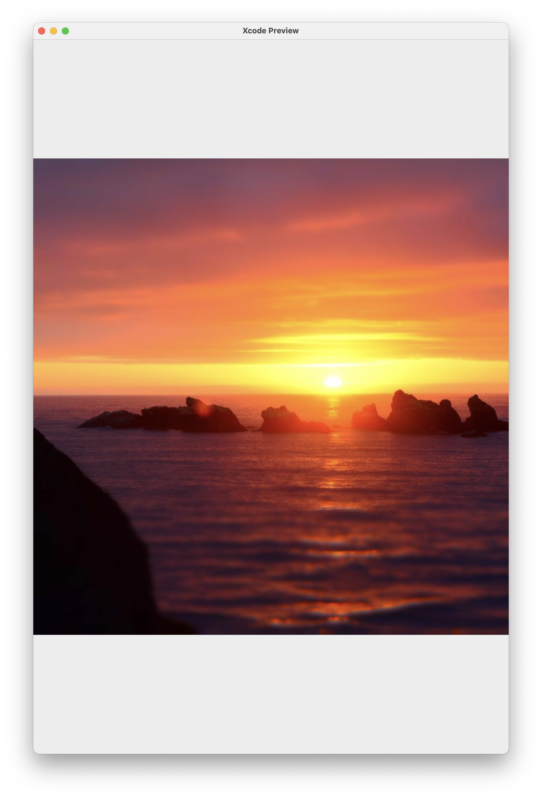

# Telescope

[](https://github.com/persello/telescope/actions/workflows/documentation.yml) [](https://github.com/persello/telescope/actions/workflows/swift.yml)

A double-cached (NSCache and local files) and hardware-accelerated web image library for SwiftUI.

For API documentation, check the [Wiki](https://github.com/persello/telescope/wiki).

## Examples

### Using an image as a SwiftUI View

```Swift
TImage(try? RemoteImage(stringURL: "https://picsum.photos/800/800"))
    .resizable()
    .placeholder({
        Text("Error!")
    })
    .scaledToFit()
    .frame(width: 800, height: 1200, alignment: .center)
```



### Editing a remote image locally

```Swift
let remoteImage = RemoteImage(stringURL: "https://my.original/image")
let aCroppedVersionOfTheImage: UIImage = ...

// Let's save the edited version
remoteImage["edited-1"] = aCroppedVersionOfTheImage

// We can use this image in Apple's Image View

// ... inside a SwiftUI body ...

    // The image can be set and recalled simply by using a subscript with a tag name
    Image(uiImage: remoteImage["edited-1"])
```

## Features

- Easy setup
- SwiftUI native
- Lightweight and easy to understand
- You can implement your own optimized caching system
- Can be set to try to refresh cached images from the Internet after a certain period of time
- Double cached (persistent and volatile)
- Uses a shared cached folder (across all apps) by default
- Customizable error placeholder
- Hardware acceleration for image scaling (using Accelerate vImage)
- Automatic image scaling based on `TImage` view size for reduced memory and storage usage
